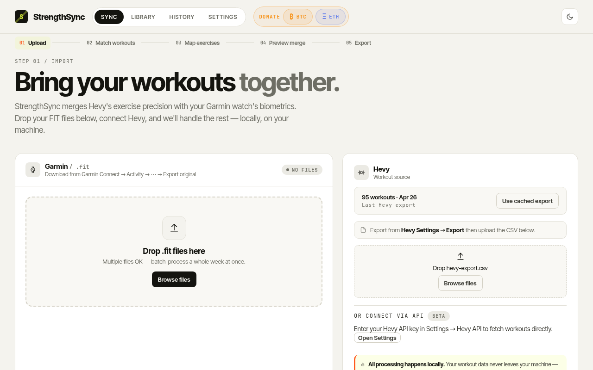
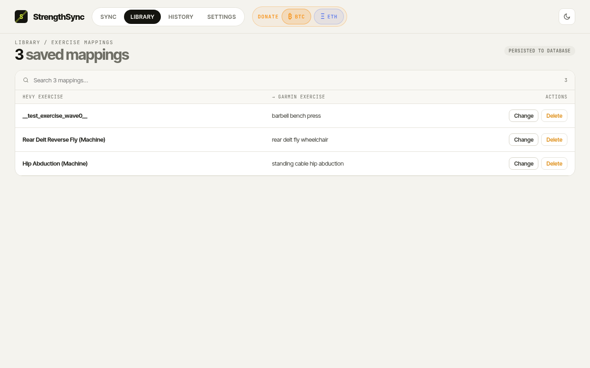
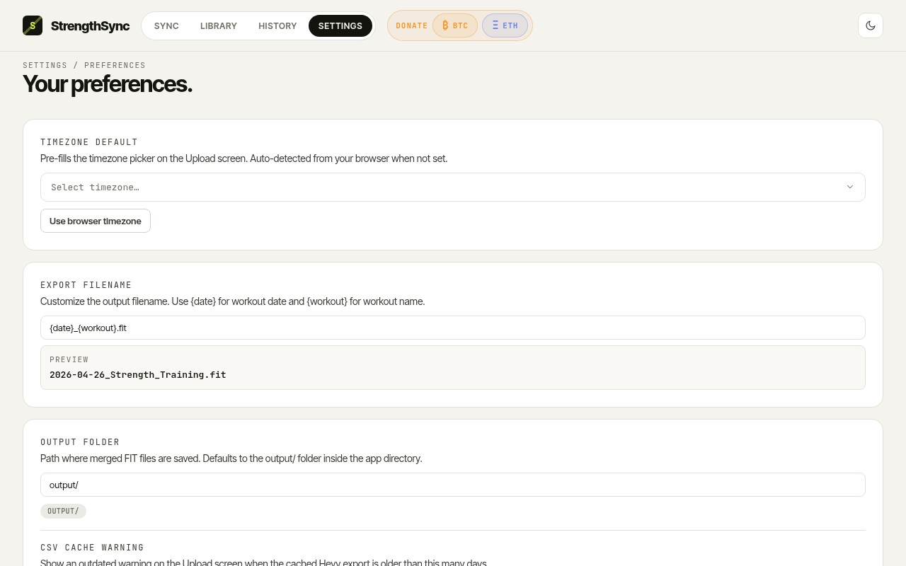
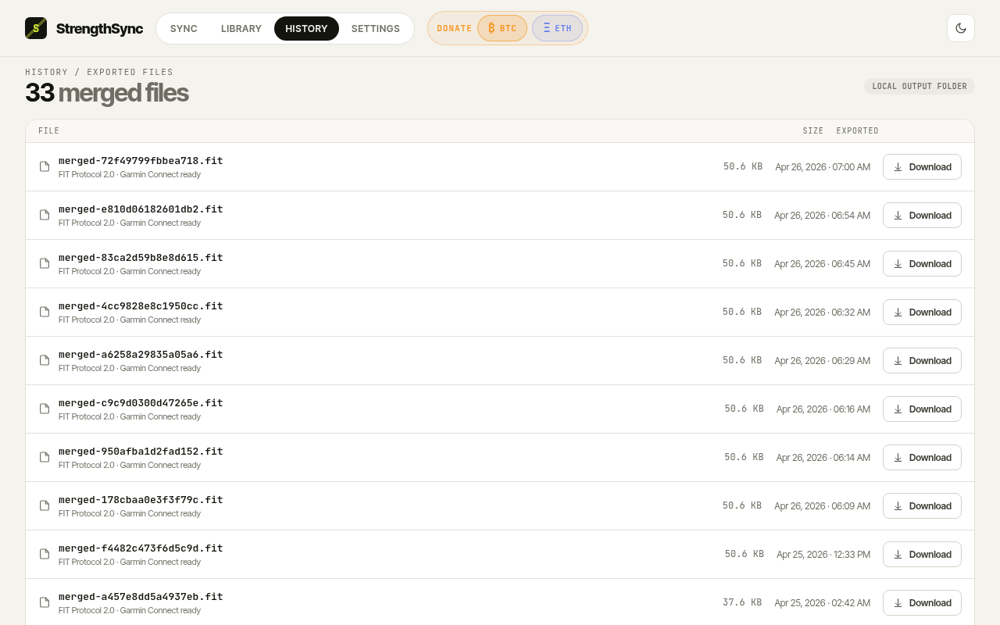

# StrengthSync &nbsp; [](#support-the-project) [](#support-the-project)

**Merge Garmin FIT biometric data with Hevy strength training logs into a single enhanced FIT file — then upload it to Garmin Connect.**

Garmin records your heart rate, calories, and GPS during a workout but labels every set as a generic "strength" exercise. Hevy knows exactly which exercise you did, how many reps, and how much weight. StrengthSync combines both into one FIT file that Garmin Connect accepts — giving you rich exercise detail alongside real biometrics.

> All processing is local. Your files never leave your machine.



---

## ⚠️ Important — read before your first sync

### 1. Verify in the Preview step, then delete the original

**Before you export:** use the **Preview merge** screen (Step 4 in the app) to review all exercise names, sets, reps, and weights alongside your Garmin biometrics. This is your chance to catch any mapping issues before committing.

**When you're ready to upload:** go to **Garmin Connect → Activities**, open the original strength training workout, and **delete it**. Then upload the merged file. Garmin detects duplicate activity timestamps and will reject the upload if the original still exists — so you must delete first.

### 2. Strava users — expect a duplicate activity

If your Garmin account is linked to Strava, uploading the merged FIT file to Garmin Connect will **automatically sync to Strava as a new activity**. You'll need to go to Strava and manually delete that duplicate after it appears.

> Tip: disconnect your Garmin → Strava auto-sync, upload the merged file to Garmin Connect, then re-enable auto-sync — or just delete the Strava duplicate.

### 3. Intensity minutes won't change

Garmin does not award intensity minutes to manually uploaded FIT files, even when the heart rate data is present and accurate. This is a Garmin platform limitation and cannot be worked around by any third-party tool.

---

## Requirements

- **Python 3.9 or later** — [python.org/downloads](https://www.python.org/downloads/)
  - Windows: check **"Add Python to PATH"** during installation
  - macOS shortcut: `brew install python3`
- A Garmin `.fit` activity file (strength training activity exported from Garmin Connect)
- A Hevy CSV export — or a Hevy API key to fetch workouts directly

---

## Quick start

### Windows

1. **Download or clone** this repo
2. Double-click **`setup.bat`** — installs everything (first time only)
3. Double-click **`start.bat`** — launches the app and opens your browser

### macOS / Linux

1. **Clone** the repo:
   ```bash
   git clone https://github.com/Exclad/StrengthSync.git
   cd StrengthSync
   ```
2. **Run setup** (first time only):
   ```bash
   chmod +x setup.sh start.sh
   ./setup.sh
   ```
3. **Launch the app:**
   ```bash
   ./start.sh
   ```

The app opens automatically in your browser. The URL is normally **http://localhost:5000** — if port 5000 is busy (common on macOS where AirPlay Receiver uses it), the app picks the next free port and prints the actual URL in the terminal.

> **macOS tip:** If you see a different port, you can free up 5000 permanently by going to **System Settings → General → AirDrop & Handoff** and turning off **AirPlay Receiver**.

### Docker (NAS / always-on server)

If you want StrengthSync running permanently — on a NAS, home server, or VPS — use Docker:

```bash
git clone https://github.com/Exclad/StrengthSync.git
cd StrengthSync
docker compose up -d
```

The app will be available at **http://your-server-ip:5000**

Your data is stored in two folders on the host that survive container restarts and updates:

| Folder | Contents |
|--------|----------|
| `./data/` | Exercise mapping database + cached Hevy CSV |
| `./output/` | All merged FIT files (re-downloadable from History tab) |

**To update to a new version:**
```bash
git pull
docker compose up -d --build
```

**Set a persistent SECRET_KEY** (required to survive container restarts without losing sessions):

1. Generate a key:
   ```bash
   python -c "import secrets; print(secrets.token_hex(32))"
   ```
2. Paste it into `docker-compose.yml`:
   ```yaml
   environment:
     - SECRET_KEY=your-generated-key-here
   ```

Without this, every container restart generates a new random key — any in-progress sync session will show "Session expired" and require re-uploading files. Your exercise mappings and merged FIT files are unaffected (those are in the volume mounts).

**To change the port** (e.g. if 5000 is taken), edit `docker-compose.yml`:
```yaml
ports:
  - "8080:5000"   # access on :8080, container still listens on 5000
```

**Data safety:**

| Command | What's preserved |
|---------|-----------------|
| `docker compose restart` | Everything — volumes intact, session cookie still valid |
| `docker compose down` then `up` | Exercise mappings, Hevy cache, merged FIT history, uploaded FIT file |
| `docker compose down -v` | ⚠️ **Deletes all volumes** — exercise mappings, history, and cached files are wiped |

> Note: the browser does not auto-open in Docker mode. Navigate to the app URL manually.

### Portainer (NAS / home server — no command line needed)

Portainer gives you a browser UI to manage Docker containers. These steps assume Portainer CE is already installed and running on your server or NAS. If it isn't, install it first from [portainer.io](https://www.portainer.io/install).

#### Step 1 — Get the files onto your server

You need the StrengthSync files on your server before Portainer can build them. The easiest way depends on your setup:

- **Synology / QNAP NAS:** use File Station or the built-in SSH terminal to run:
  ```bash
  git clone https://github.com/Exclad/StrengthSync.git /volume1/docker/StrengthSync
  ```
- **Any server with SSH access:**
  ```bash
  git clone https://github.com/Exclad/StrengthSync.git ~/StrengthSync
  ```
- **No terminal at all:** download the ZIP from GitHub (Code → Download ZIP), then extract it onto your server using your NAS file manager.

#### Step 2 — Build the image in Portainer

1. Open Portainer in your browser and select your **environment** (e.g. local or your NAS).
2. In the left sidebar, click **Images**.
3. Click **Build a new image**.
4. Give the image a name, e.g. `strengthsync:latest`.
5. Under **Upload**, switch to the **Path** tab and enter the full path to the folder you cloned in Step 1, for example `/volume1/docker/StrengthSync`.
6. Click **Build the image**. Wait for it to complete — you'll see the build log scroll by. A green tick means success.

#### Step 3 — Create the container

1. In the left sidebar, click **Containers → + Add container**.
2. Fill in the form:

   | Field | Value |
   |-------|-------|
   | **Name** | `strengthsync` |
   | **Image** | `strengthsync:latest` |

3. Scroll to **Network ports** → click **+ publish a new network port**:

   | Host port | Container port | Protocol |
   |-----------|----------------|----------|
   | `5000` | `5000` | TCP |

4. Scroll to **Volumes** → click **+ map an additional volume** twice:

   | Host path | Container path | Type |
   |-----------|----------------|------|
   | `/volume1/docker/StrengthSync/data` | `/app/data` | Bind |
   | `/volume1/docker/StrengthSync/output` | `/app/output` | Bind |

   > Adjust the host paths to match where you cloned the repo. Create the `data/` and `output/` folders first if they don't exist.

5. Scroll to **Env** → click **+ add an environment variable**:

   | Name | Value |
   |------|-------|
   | `SECRET_KEY` | *(paste a random string — see tip below)* |

   > To generate a key: on any machine with Python, run `python -c "import secrets; print(secrets.token_hex(32))"` and copy the output. Without this, sessions will reset on every container restart.

6. Scroll down and set **Restart policy** to **Unless stopped**.

7. Click **Deploy the container**.

#### Step 4 — Open the app

Navigate to **http://your-server-ip:5000** in your browser. StrengthSync should be running.

#### Updating to a new version

1. SSH into your server and run:
   ```bash
   cd /volume1/docker/StrengthSync
   git pull
   ```
2. In Portainer → **Images** → rebuild `strengthsync:latest` using the same path (Step 2 above).
3. In Portainer → **Containers** → stop and remove the old `strengthsync` container.
4. Re-create it following Step 3 above. Your `data/` and `output/` folders are untouched.

---

## How to use

### Step 1 — Export your files

**From Garmin Connect:**
1. Open [connect.garmin.com](https://connect.garmin.com)
2. Go to **Activities** → open your strength training workout
3. Click **⋯ → Export Original**
4. Save the `.fit` file

**From Hevy** (CSV export):
1. Open Hevy → **Settings → Export Workout Data → CSV**

**Or use the Hevy API** (Settings → Hevy API) to fetch workouts directly — no CSV needed.

---

### Step 2 — Upload

On the **Sync** screen:
- Drop your Garmin `.fit` file on the left
- Drop your Hevy CSV on the right — or click **"Use cached export"** if you've synced before, or **"Fetch from Hevy API"** if you have an API key set up in Settings
- Select your timezone (auto-detected from your browser)
- Click **Continue**

After your first sync, StrengthSync caches your Hevy CSV so you don't need to re-upload it every time.

---

### Step 3 — Match workouts

The app finds the Hevy workout closest in time to your Garmin activity (within 30 minutes). If the match looks wrong, pick the correct Hevy workout manually.

---

### Step 4 — Map exercises

The app fuzzy-matches your Hevy exercise names to Garmin's exercise library. Each match shows a confidence score:

| Confidence | Colour | Action |
|------------|--------|--------|
| ≥ 70% | Green | Auto-accepted |
| < 70% | Amber | Review — pick from suggestions or search |
| No match | Grey | Search manually or skip |

Confirmed mappings are saved so you only map each exercise once across all future syncs.



---

### Step 5 — Preview & export

Review the side-by-side comparison of Garmin biometrics vs. Hevy exercise detail. Click **Export merged FIT** to download.

---

### Step 6 — Upload to Garmin Connect

1. Go to [connect.garmin.com](https://connect.garmin.com)
2. **Delete** the original strength training activity (see warning at top)
3. Click the **+** upload button (top right)
4. Drag the downloaded `merged-*.fit` file
5. If you use Strava: **delete the duplicate** that auto-syncs

---

## Settings

Click **Settings** in the top nav to configure:

| Setting | Description |
|---------|-------------|
| **Timezone Default** | Pre-fills the timezone on the Sync screen. Auto-detected from your browser. |
| **Export Filename** | Template for downloaded filenames. Use `{date}` and `{workout}` as placeholders. |
| **Output Folder** | Label for where files are saved (informational). |
| **CSV Cache Warning** | Show an OUTDATED warning when your cached Hevy export is older than N days (default 7). |
| **Hevy API (Beta)** | Paste your Hevy API key to fetch workouts directly without uploading a CSV each time. Use the **Test connection** button to verify your key. |
| **Danger Zone** | Clear all saved exercise mappings and start fresh. |



---

## Library & History

- **Library** — all your confirmed exercise mappings, searchable and editable
- **History** — all merged FIT files in the `output/` folder, re-downloadable anytime



---

## Project structure

```
StrengthSync/
├── setup.bat / setup.sh    # First-time setup (creates venv, installs deps)
├── start.bat / start.sh    # Launch the app
├── app.py                  # Flask web server + API routes
├── fit_parser.py           # Garmin FIT file reader
├── fit_generator.py        # FIT file writer + merge pipeline
├── hevy_parser.py          # Hevy CSV + API response parser
├── matcher.py              # Workout time-matching (timezone-aware)
├── mapper.py               # Exercise fuzzy-matching + DB lookup
├── database.py             # SQLite schema and queries
├── models.py               # Shared data models
├── requirements.txt        # Python dependencies
├── garmin_exercises.csv    # Garmin exercise enum database (~600 exercises) — baked into Docker image
├── data/
│   └── hevy_cache.csv         # Cached Hevy export (auto-created after first sync)
├── static/src/                # React JSX components
└── templates/index.html       # Single-page app shell
```

---

## Dependencies

| Package | Purpose |
|---------|---------|
| `flask` | Web server |
| `fitparse` | Reading Garmin FIT files |
| `fit-tool` | FIT file validation |
| `garmin-fit-sdk` | Writing FIT records (official Garmin encoder) |
| `pandas` | Hevy CSV parsing |
| `python-dateutil` | Timestamp parsing |
| `rapidfuzz` | Exercise name fuzzy matching |
| `qrcode[pil]` | Donation QR code generation |

---

## Limitations & known behaviour

- **Intensity minutes** — Garmin does not award intensity minutes to manually-uploaded FIT files regardless of heart rate data. This is a Garmin platform limitation with no workaround.
- **Duplicate activity** — Uploading the merged file does not replace the original. You must delete the original Garmin activity manually before or after uploading.
- **Strava auto-sync** — Uploading to Garmin Connect triggers Strava sync, creating a duplicate. Delete the Strava duplicate manually.
- **Set timing** — Hevy does not record per-set timestamps. Sets are distributed linearly across your workout window using Garmin's original timestamps.
- **Cardio exercises** — Treadmill, stair machine, and other cardio rows in the Hevy CSV are automatically skipped.
- **Single user** — Local single-user app. No login, no cloud sync.
- **Hevy API** — The Hevy API is unofficial and may change without notice. CSV export is always the reliable fallback.

---

## Troubleshooting

**"FIT file failed to parse"** — Re-export from Garmin Connect using **Export Original** (not GPX or CSV).

**"This FIT file doesn't contain a workout session"** — You've uploaded a health monitoring file instead of a workout activity file. This happens if you downloaded from Garmin's **"Export Your Data"** archive (the zip with filenames like `youremail_61583XXXXX.fit`) — those are daily health logs, not workouts. To get the right file: open [Garmin Connect](https://connect.garmin.com) → **Activities** → click your strength training session → **⋯ menu → Export Original**. Each workout produces one `.fit` file.

**"No Hevy workout found within 30 minutes"** — The workouts are more than 30 minutes apart. Use the manual match selector.

**"Session expired"** — Re-upload your files to start a new session. In Docker, this also happens after every container restart unless you set a persistent `SECRET_KEY` in `docker-compose.yml` (see the Docker section above).

**Mapping seems wrong** — Go to the Map step, click the exercise name, and search for the correct Garmin exercise. Changes save immediately.

**I have two activities on Garmin Connect / Strava** — You uploaded the merged file without deleting the original. Delete the original Garmin activity (the one with no exercise names) and the Strava duplicate if applicable.

**start.bat does nothing / closes immediately** — Make sure you ran `setup.bat` first. If Python isn't found, reinstall Python with **"Add Python to PATH"** checked.

---

## Support the project

StrengthSync is free and open source. If it saves you time, a small donation is appreciated — you can also click the **₿ BTC** or **Ξ ETH** buttons inside the app.

**Bitcoin (BTC)**
```
bc1qhjqappn6ere3239dqnzksuectktp62pdhu77qt
```

**Ethereum (ETH) / ERC-20 tokens**
```
0x2716b0D80465a98Ada440b0c440F43c23E1Bd717
```

> The ETH address accepts Ether and any ERC-20 token (USDC, USDT, DAI, etc.) on the Ethereum mainnet.

---

## License

MIT
